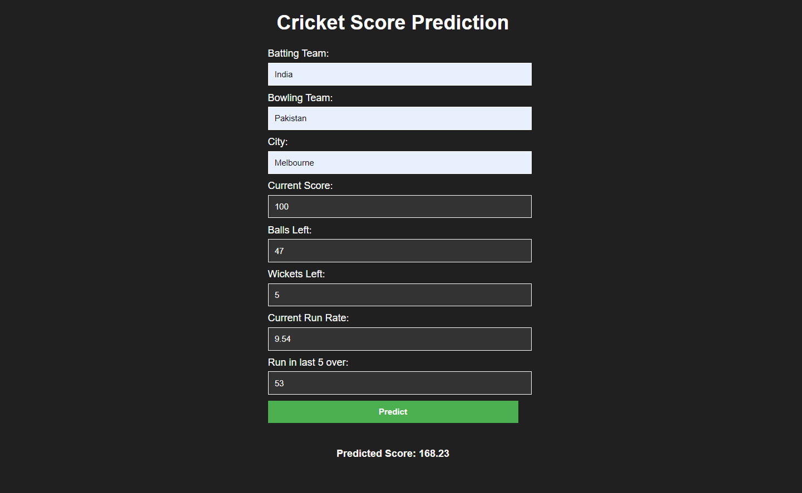
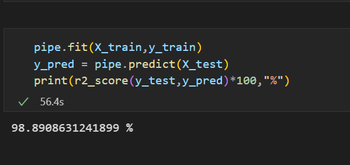

# Cricket Score Predictor

## Introduction

Welcome to the Cricket Score Predictor repository! This is where the magic of machine learning meets the excitement of T20 cricket. The code in this repository showcases a powerful machine learning system designed to predict the scores of T20 cricket matches accurately.

## Table of Contents

- [Project Description](#project-description)
- [Installation](#installation)
- [Usage](#usage)
- [Acknowledgments](#acknowledgments)

## Project Description

The Cricket Score Predictor is a fascinating machine learning project tailored specifically for T20 cricket enthusiasts. With the integration of cutting-edge algorithms, it accurately forecasts the scores of T20 cricket matches, providing valuable insights into the game's dynamics and potential outcomes.
### Feature and Accuracy
#### Features:     
    "batting_team"
    "bowling_team"
    "city"
    "current_score"
    "balls_left"
    "wickets_left"
    "crr"
    "last_five" 
#### Label: 
    "run_x"
Accuracy in terms of [R Square Value] 0.98890

## Installation

To set up the Cricket Score Predictor on your local machine, follow these steps:

1. Clone the repository to your local machine using `git clone https://github.com/Uni-Bo/Cricket_Score_Predictor.git`.
2. Navigate to the project directory: `cd Cricket_Score_Predictor`.
3. Create a virtual environment (optional but recommended) to isolate the project dependencies: `python -m venv venv`.
4. Activate the virtual environment:
   - On Windows: `venv\Scripts\activate`
   - On macOS and Linux: `source venv/bin/activate`
5. Install the required dependencies: `pip install -r requirements.txt`.

## Usage

This repository contains the complete code for the Cricket Score Predictor system. To utilize this system for score predictions, please follow the instructions outlined in the project's directory. You can feed in relevant match data, and the predictor will deliver accurate score estimates.

## Acknowledgments

We would like to express our gratitude to the cricket community for the inspiration and support that fueled the creation of this predictor. Additionally, we acknowledge the use of the dataset from Kaggle, specifically the ["Cricsheet: A Retrosheet for Cricket"](https://www.kaggle.com/datasets/veeralakrishna/cricsheet-a-retrosheet-for-cricket?select=t20s) dataset, provided by Veera Krishna. The dataset has been instrumental in training our machine learning models, and we are thankful for its availability.

Together, we hope to enhance the excitement of T20 cricket with the power of machine learning!
